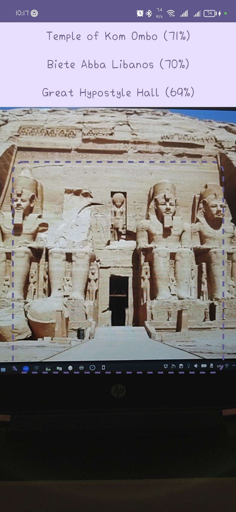

# Landmark Recognition
Landmark Recognition is a native Android mobile application that uses Kotlin Programming Language to get names of landmarks in Africa.

## Application Features:
* Search for information of a landmark in Africa.
* Just open the camera and point the mobile phone at the place and you will get its information.
* Clicking on the information leads you to its information in the browser.

## Tools used
* Kotlin.
* Jetpack Compose.
* CameraX.
* Tensorflow Lite.

## Downloads
[APK Download](https://drive.google.com/file/d/1-R1ngOxF8L3DmVmURcptYj8vlBEN2sXK/view?usp=sharing)

## Screenshots

  
  

